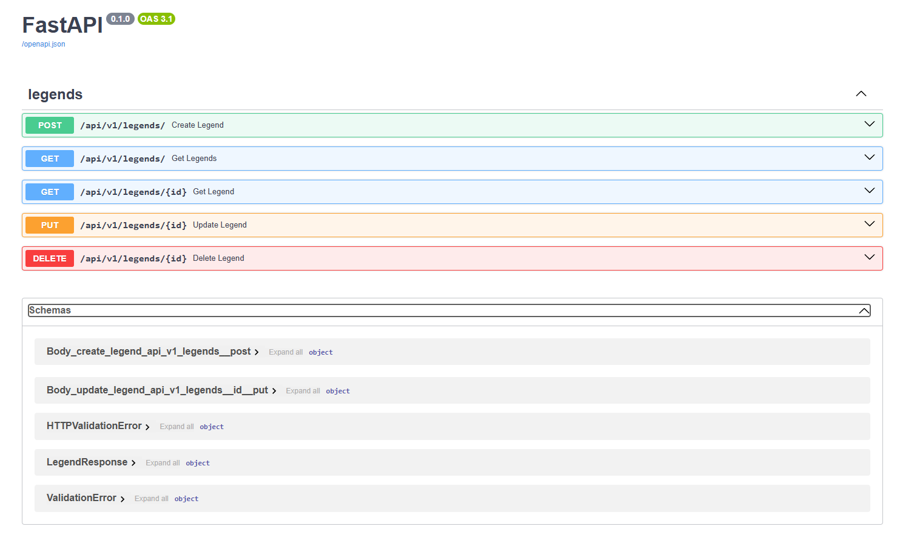

A continuación, un **ejemplo** de un archivo `README.md` para tu proyecto **FastAPI** con Docker Compose. Puedes ajustarlo según tu estructura real, variables de entorno y detalles de despliegue:

---

# 4thewords Backend Michael Hernandez



Este proyecto es un backend construido con **FastAPI** y **SQLModel**, gestionado con **Alembic** para migraciones y contenedorizado mediante **Docker Compose**.

## Características

- **FastAPI** como framework principal.
- **SQLModel** y **Alembic** para manejar la base de datos (migraciones, modelos).
- **MySQL** como base de datos.
- **Docker Compose** para levantar la aplicación y la base de datos.
- **Endpoints** para CRUD de leyendas (legends).

## Requisitos previos

- **Git** instalado.
- **Docker** y **Docker Compose** instalados.
- (Opcional) **Python 3.9+** si deseas ejecutar localmente sin Docker.

## Instalación

1. **Clonar** el repositorio:

   ```bash
   git clone https://github.com/Maicol-Hernandez/4thewords_backend_michael_hernandez.git
   cd 4thewords_backend_michael_hernandez
   ```

2. **Configurar** variables de entorno (opcional):

   - Puedes usar un archivo `.env` en la raíz para definir variables como `DB_DATABASE`, `DB_USERNAME`, `DB_PASSWORD`, etc.
   - Ejemplo de `.env`:
     ```env
     DB_CONNECTION=mysql
     DB_HOST=mysql
     DB_PORT=3306
     DB_DATABASE=4thewords_prueba_michael_hernandez
     DB_USERNAME=app_user
     DB_PASSWORD=secret123
     ENVIRONMENT=dev
     RELOAD=1
     ```

3. **Construir y levantar** los contenedores con Docker Compose:

   ```bash
   docker compose build
   docker compose up --build
   ```

   Esto:

   - Construye la imagen de la app (fastapi).
   - Inicia el contenedor de MySQL y el contenedor de la app.

4. **Verificar** que los servicios están corriendo:
   - La base de datos MySQL en el puerto `3306`.
   - El backend en el puerto `80` (o el que definas en `docker-compose.yml`).

## Uso

- Una vez en ejecución, la API está disponible en [http://localhost:8080](http://localhost:8080).
- La documentación interactiva de FastAPI (Swagger UI) se encuentra en [http://localhost:8080/docs](http://localhost:8080/docs).
- Para ver el estado de la aplicación:
  ```bash
  docker compose ps
  ```
- Para detener la aplicación:
  ```bash
  docker compose down
  ```

## Migraciones con Alembic

Si necesitas ejecutar migraciones manualmente (por ejemplo, `alembic upgrade head`), puedes:

1. Entrar al contenedor de la app:
   ```bash
   docker compose exec fastapi-app /bin/bash
   ```
2. Dentro del contenedor, ejecutar:
   ```bash
   alembic upgrade head
   ```
   Ajusta según tu estructura (`migrations/` y `env.py`).

## Semillas (Seeders)

- Para insertar datos iniciales (leyendas, etc.), el proyecto cuenta con scripts o migraciones que hacen “seed” de la base de datos.
- Revisa la carpeta `seeders` o la migración correspondiente para detalles.
- Podrías correrlos en el contenedor, por ejemplo:
  ```bash
  docker compose exec fastapi-app python seeders/legend_seeder.py
  ```

## Estructura de Carpetas (Ejemplo)

```plaintext
4thewords_backend_michael_hernandez/
├─ app/
│  ├─ core/
│  │  ├─ config.py
│  │  ├─ database.py
│  ├─ models/
│  │  └─ legend.py
│  ├─ api/
│  │  └─ v1/
│  ├─ main.py
├─ migrations/
│  ├─ env.py
│  ├─ versions/
├─ docker/
│  └─ dev/
├─ docker-compose.yml
├─ requirements.txt
├─ README.md
└─ ...
```

## Endpoints principales

- `GET /api/v1/legends` — lista de leyendas, con filtros opcionales.
- `POST /api/v1/legends` — crear una nueva leyenda.
- `GET /api/v1/legends/{id}` — obtener una leyenda por ID.
- `PUT /api/v1/legends/{id}` — actualizar una leyenda.
- `DELETE /api/v1/legends/{id}` — eliminar una leyenda.

Para más detalles, consulta [http://localhost:8080/docs](http://localhost:8080/docs) cuando el contenedor esté en marcha.

## Contribuciones

- Crea un fork del proyecto.
- Crea una rama (`git checkout -b feature/my-feature`).
- Realiza tus cambios y haz commit (`git commit -m 'Add some feature'`).
- Haz push a la rama (`git push origin feature/my-feature`).
- Abre un Pull Request.

## Licencia

[MIT](LICENSE)
